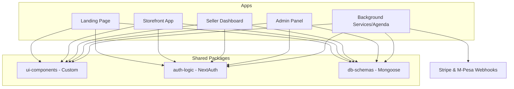

# VENDORA - Multi-Tenant E-Commerce SaaS (Monorepo)
Live Demo - https://vendora.sbs

A production-grade, multi-tenant SaaS platform engineered to handle complex e-commerce operations. This project features a custom state management engine, strict data isolation, and a monorepo architecture managing 5 distinct applications.

# System Architecture.
The project is managed as a pnpm monorepo, ensuring a unified type system and shared logic across all services.

# Application Breakdown.
- Storefront: High performance customer interface with subdomain-aware routing.
- Seller Dashboard: Multi-tenant inventory management, order processing and product creation.
- Admin Panel: Platform-wide RBAC, tenant management, and cross-tenant analytics.
- Background Services: Dedicated Express worker utilizing Agenda for asynchronous job scheduling.

# Security & Data Isolation
The core of this SaaS is Strict Resource-Based Authorization.
- Explicit Tenant Scoping: I do not rely on global filters but rather every database query explicitly passes a verified tenantId retrieved from the NextAuth session. This prevents Insecure Direct Object Reference (IDOR) and ensures data integrity.
- RBAC Enforcement: Users are redirected at the middleware level based on JWT role claims (ADMIN, SELLER, BUYER).
- App-Level Separation: The admin logic is physically separated from the Seller logic into different apps within the monorepo, significantly reducing the attack surface.

# Financial Engineering
Handling payments across different regions requires high reliability and defensive programming.
 - Dual Gateway Integration: Native support for Stripe(Global Cards) and M-Pesa (STK Push/Daraja API).
 - Idempotency & Reconciliation: To prevent double-charging, every transaction is tracked via unique gateway IDs in MongoDB.
 - Webhook Reliability: Callbacks are processed through Agenda with retry logic. Before updating any order to PAID, the system verifies the transaction status to ensure eventual consistency even if a server fails mid-process.

# Technical Deep-Dives
#Custom State Management (useSyncExternalStore)
- To avoid overhead of heavy libraries, I built a custom cart engine using React's useSyncExternalStore primitive. This ensures tearing-free, concurrent-safe state that remains consistent across the monorepo apps with zero external dependencies.

#Server-Side Checkout Validation
While the cart lives on the client, the /checkout route is session-protected and server-validated. Upon initiation, the cart is reconciled against the database to prevent client-side "price manipulation" before the payment session is generated.

# Tech Stack
 - Fronted: Next.js (App Router), Tailwind CSS, Custome UI (MUI Icons/Toast)
 - State: useSyncExternalStore (Custom Store)
 - Backend: Node.js, Express, Agenda (Job Scheduling)
 - Database: MongoDB (mongoose)
 - Auth: NextAuth with Role-Based Redirects
 - Payments: Stripe & M-pesa (Daraja API)
 - Tooling: pnpm Workspaces, Typescript (Fully Typed)

# Guided Demo Experience
To explore the platform's lifecycle, please use these entry points and test credentials.
# Storefront.
- Access url https://store.vendora.sbs
- Role: Guest
- Checkout: To access you'll need credentials.
- Key Features:
  -- subdomain-scoping and custom cart.
  -- session protected checkout.

# Seller Dashboard
- Access url https://seller.vendora.sbs
- Role: seller
- Key Features:
  -- Tenant scoped inventory management

# Admin Panel
- Access url https://admin.vendora.sbs
- Role: admin
- Key Features:
  -- Platform-wide RBAC & Analytics

# Development Milestones (6-Month Solo Build)
- Month 1-2: Foundation of the pnpm Monorepo, shared UI, AUTH, DB packages, and NextAuth RBAC architecture.
- Month 3-4: Core commerce engine, custom state management implementation, and subdomain routing logic.
- Month 5: Integration of Stripe and M-Pesa with a dedicated Agenda service for webhook idempotency.
- Month 6: Dashboard development (Admin/Seller) and final security audits for data isolation.
